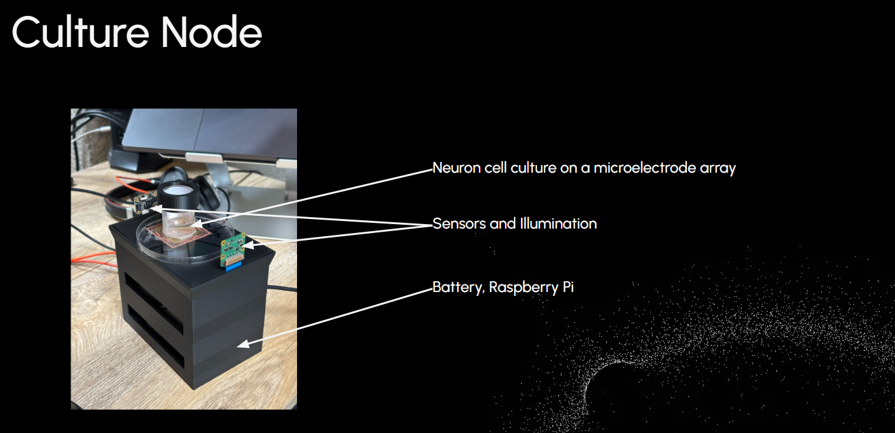
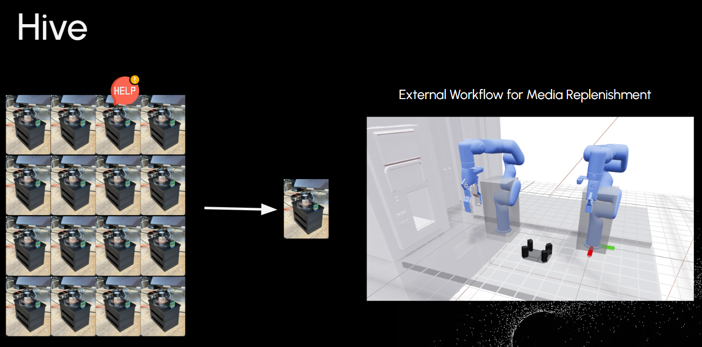

# Hive Mind: Distributed Monitoring of Cell Culture
*Project for the 24 Hour Hackathon @ Zeon Systems*

### Problem:
Neuron cell culture grown on microelectrode arrays (MEA) require heavy maintenance due to fast evaporation rates of cell culture media.
Cells are sensitive to the molality of the cell culture media and thus fast evaporation, requires continuous maintenance of the concentration of the media components.
Scientists are bottlenecked the maintenance required to maintain healthy cell populations.

### Approach:
Develop a system in which each cell culture can request media upkeep when evaporation of media has crossed a threshold value. 
Crossing the threshold triggers the retrieval of the cell culture and the execution of a media maintenance routine performed by a traditional automation setup.

**Culture Node**
A 3D printed housing was designed and printed to hold the cell culture and sensing unit. The sensing unit packs a camera, diode array, a raspberry pi, and a battery pack within the base.
A webserver runs on the raspberry pi allowing for remote monitoring at the required cadence.

**Hive**
An OpenShelf unit configured to intake up to 30 culture nodes for storage during stasis with a custom developed API to register, manage, and monitor the registered cultures while they reside within automated storage.

### System Design:
Each culture node hosts its own web server which allows for querying of the current media level. An orchestration layer (HiveOverwatch) lays on top of everything to manage
node registration and triggering of entry and exit of the nodes along with execution of the maintenance routines.

